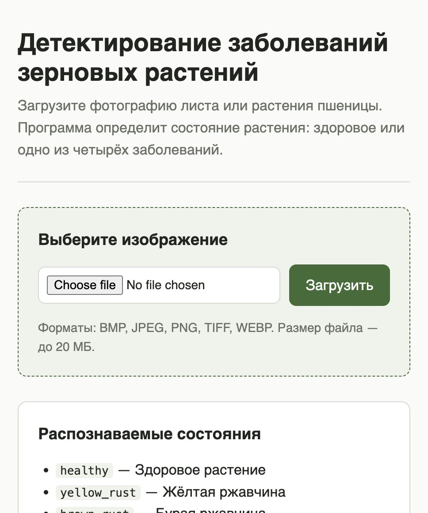
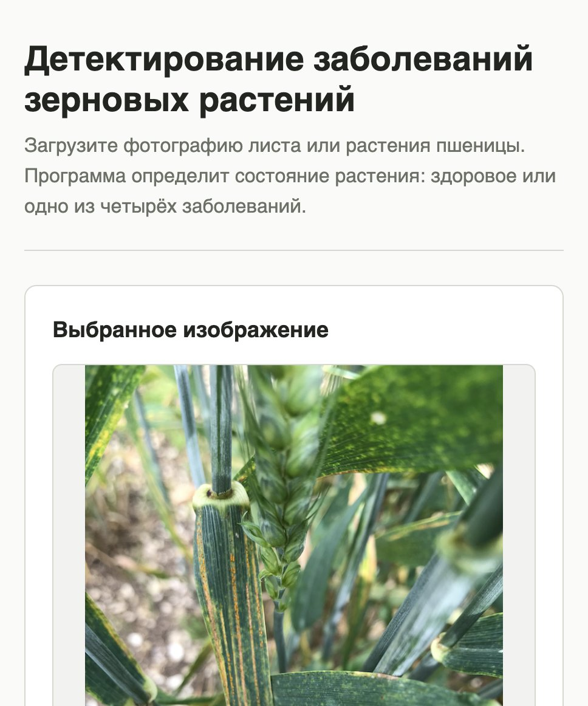
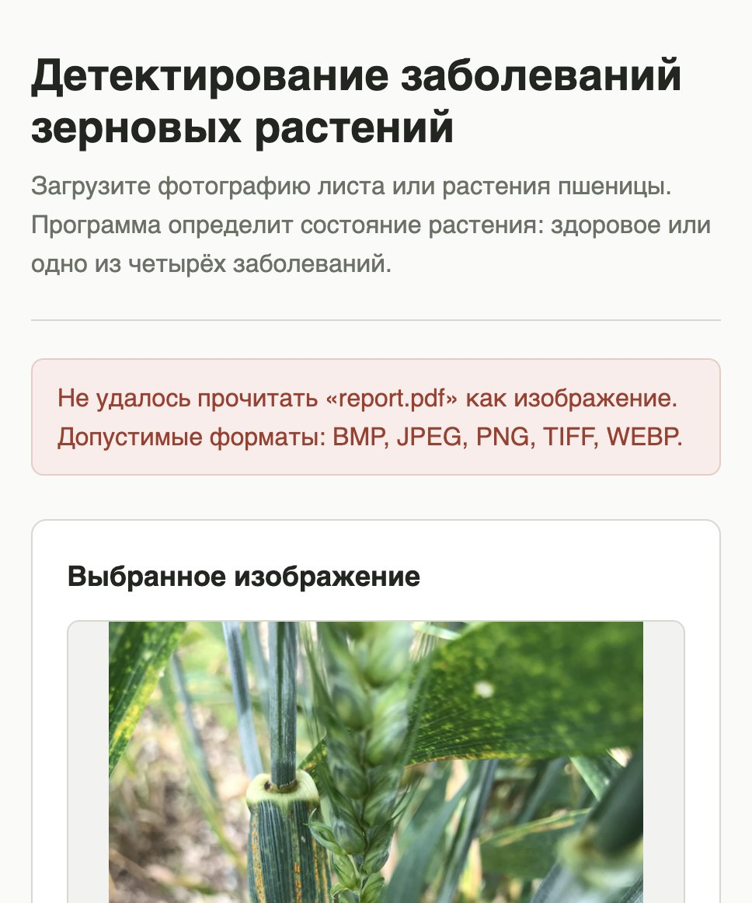

# Этап 2 — техническая основа и приём произвольного изображения

**Статус:** выполнен.

## Что требовалось по плану

> Создан git-репозиторий, создан проект, проект собирается и запускается,
> пользователь может выбрать изображение, выбранное изображение отображается,
> можно заменить другой фотографией.

## Что сделано

| Требование | Как закрыто |
| --- | --- |
| Создан git-репозиторий | [GlebGorbat-dev/PIS2026](https://github.com/GlebGorbat-dev/PIS2026), ветка `main` |
| Создан проект, собирается и запускается | приложение FastAPI, запуск одной командой `uvicorn`, зависимости закреплены в `requirements.txt` |
| Пользователь может выбрать изображение | форма загрузки на главной странице, `POST /upload` |
| Выбранное изображение отображается | страница показывает сам снимок и его характеристики |
| Можно заменить другой фотографией | блок «Заменить другой фотографией»; прежний файл удаляется с диска |

## Как запустить

```bash
pip install -r requirements.txt
uvicorn src.app.main:app --reload
```

Открыть <http://127.0.0.1:8000>.

## Пользовательский сценарий

Пустое состояние — программа просит выбрать снимок и сразу сообщает
ограничения: допустимые форматы и предельный размер файла.



После загрузки снимок отображается вместе с характеристиками: собственное имя
файла пользователя, формат, размер кадра и объём. Рядом — кнопка распознавания
и возможность заменить фотографию или убрать её.



Если вместо изображения пришёл посторонний файл, программа объясняет, что
именно не так, и перечисляет допустимые форматы. Важно, что ранее выбранный
снимок при этом остаётся на месте: неудачная замена не должна стирать то, с чем
пользователь уже работал.



## Устройство

```
src/app/settings.py            ограничения на загрузку
src/app/storage.py             проверка, сохранение и удаление снимка
src/app/main.py                маршруты FastAPI
src/app/templates/index.html   единственная страница приложения
src/app/static/styles.css      оформление
tests/test_app_upload.py       15 тестов на весь сценарий
data/uploads/                  загруженные снимки (не в git)
```

Маршруты:

| Маршрут | Назначение |
| --- | --- |
| `GET /` | страница: форма выбора либо выбранный снимок |
| `POST /upload` | приём файла, проверка, сохранение, ответ перенаправлением |
| `GET /image` | отдаёт текущий снимок пользователя |
| `POST /reset` | убирает выбранный снимок |
| `POST /predict` | точка подключения модели; до этапа 6 отвечает 501 |
| `GET /health` | состояние приложения, список классов, признак загруженной модели |

## Решения, принятые на этапе, и их причины

**Формат определяется по содержимому файла.** Ни расширение, ни заголовок
`Content-Type` не проверяются: и то и другое задаёт клиент, и «произвольное
изображение» из требований на практике означает, что придёт и `.jpg`, внутри
которого лежит PDF. Pillow открывает файл и говорит настоящий формат; только
после этого файл попадает на диск.

**Ограничения заданы явно, а не по умолчанию.** Принимаются файлы до 20 МБ
и изображения до 50 мегапикселей, меньшая сторона — не менее 64 пикселей.
Предел по пикселям нужен против decompression bomb: небольшой PNG умеет
разжиматься в изображение на десятки гигабайт и положить процесс. Нижняя
граница отсекает иконки, на которых распознавать болезнь бессмысленно.

**Имя файла на диске не совпадает с именем от пользователя.** Файл сохраняется
под случайным идентификатором `secrets.token_urlsafe(24)`, а исходное имя
лежит рядом в небольшом JSON и используется только для показа. Это решает
сразу две задачи: имя от пользователя никогда не участвует в построении пути
(значит, `../../etc/passwd` безвреден), а угадать идентификатор чужой загрузки
нельзя. На оба случая есть тесты.

**Снимок отдаётся своим маршрутом, а не через раздачу статики.** `GET /image`
берёт идентификатор из cookie самого пользователя, а не из адреса, поэтому
каталог загрузок не выставлен в сеть и чужой файл запросить невозможно.
Cookie помечена `HttpOnly`, чтобы её не мог прочитать скрипт на странице.

**Неудачная загрузка не стирает прежний выбор.** Если проверка не прошла,
приложение возвращает ту же страницу с текстом ошибки, а ранее выбранный
снимок остаётся. Обратное поведение раздражало бы: пользователь терял бы
рабочий файл из-за случайного промаха в диалоге выбора.

**Успешная загрузка отвечает перенаправлением (303), а не страницей.** Иначе
обновление страницы в браузере повторяло бы отправку файла.

**Маршрут `POST /predict` добавлен сразу.** Он уже принимает текущий снимок
и пока честно отвечает `501 Not Implemented` с пояснением, что модель
появится на этапе 6. Так на этапе 6 меняется только тело одной функции,
а вёрстка и сценарий остаются прежними.

## Проверка результата

```bash
pytest -q
```

15 тестов проходят. Покрыты: открытие страницы, загрузка и отображение
снимка, замена на другой с удалением прежнего файла, сброс выбора, показ
собственного имени файла, сохранение прежнего снимка при неудачной замене,
а также отказы — пустой файл, не изображение,
слишком большой файл, слишком мелкое изображение, неподдерживаемый GIF,
попытка подставить чужой идентификатор и путь в имени файла.

## Что дальше, на этапе 4

Загрузчик данных поверх `data/processed/splits/*.csv`, обучение модели на
5 классов и функция предсказания, которую на этапе 6 вызовет `POST /predict`.
