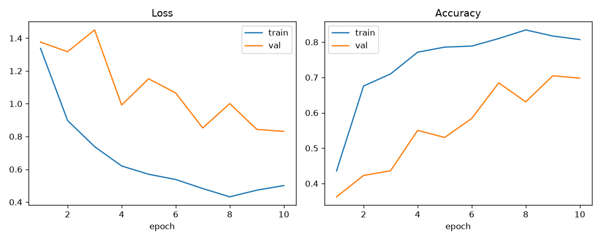

# Этап 4 — первая модель классификации

**Статус:** выполнен.

## Что требовалось по плану

> Модель обучена, веса сохранены, известна конфигурация обучения, программа
> может передать модели фотографию, модель возвращает класс и уверенность.

## Что сделано

| Требование | Как закрыто |
| --- | --- |
| Модель обучена | MobileNetV3-Small, предобученный на ImageNet, 10 эпох на train (700 снимков) |
| Веса сохранены | `models/stage4.pt` (5,9 МБ), внутри state_dict, имена классов и конфиг |
| Известна конфигурация обучения | `configs/train.yaml` плюс копия внутри чекпоинта |
| Программа передаёт фотографию и получает класс с уверенностью | `src.model.predict(image) -> Prediction` |

Тестовая выборка на этом этапе **не трогалась**. Официальные метрики — этап 5.

## Как запустить

Обучение (повторяет этот этап):

```bash
python -m src.model.train
```

Предсказание:

```bash
python -m src.model.predict data/raw/extracted/YellowRust1010.png
```

или из кода:

```python
from src.model.predict import predict

result = predict("data/raw/extracted/YellowRust1010.png")
print(result.class_name, result.confidence)
```

## Конфигурация обучения

Зафиксирована в `configs/train.yaml` и продублирована в чекпоинте.

| Параметр | Значение | Зачем так |
| --- | --- | --- |
| Архитектура | MobileNetV3-Small | маленькая сеть, быстро учится на ноутбуке, не «выжимает» датасет |
| Предобучение | ImageNet | 700 снимков недостаточно, чтобы учить свёртки с нуля |
| Backbone заморожен | да | на этапе 4 учится только классификатор; разморозка — кандидат на этап 10 |
| Размер входа | 224×224, нормализация ImageNet | стандарт для этой сети |
| Оптимизатор | Adam, lr=0.001, weight decay=1e-4 | обычный старт для обучаемой головы |
| Эпохи | 10, early stopping patience=4 | короткое обучение, чтобы не подогнаться под val |
| Аугментации | crop, горизонтальный флип, лёгкий ColorJitter | только train |
| Веса классов | обратно пропорциональны частоте | `septoria` втрое чаще `healthy` |
| Seed | 42 | повторяемость |
| Устройство | MPS (Apple Silicon) | |

RGBA приводится к RGB в загрузчике: 974 из 998 файлов датасета — PNG с альфой, модели нужен трёхканальный вход.

## Результат обучения

Лучший чекпоинт — эпоха 9, **val accuracy 0,705**. Тест не считался.

| Эпоха | train acc | val acc |
| --- | --- | --- |
| 1 | 0,436 | 0,362 |
| 4 | 0,771 | 0,550 |
| 7 | 0,810 | 0,685 |
| 9 | 0,817 | **0,705** |
| 10 | 0,807 | 0,698 |



Train обгоняет val примерно на 0,11 — модель уже немного подстраивается под обучающую выборку, но до переобучения «в ноль ошибок» далеко. Это ожидаемо для замороженного backbone: признаки ImageNet не заточены под полевые пятна ржавчины.

Проверка `predict` на одном кадре каждого класса из val:

| Истина | Предсказание | Уверенность |
| --- | --- | --- |
| `brown_rust` | `brown_rust` | 0,635 |
| `healthy` | `healthy` | 0,993 |
| `mildew` | `yellow_rust` | 0,553 |
| `septoria` | `septoria` | 0,529 |
| `yellow_rust` | `yellow_rust` | 0,987 |

Ошибка на `mildew` совпадает с гипотезой этапа 3: мучнистая роса снята в теплице, остальные классы — в поле. Модель путает её с жёлтой ржавчиной. Разбор — на этапе 9, чинить сейчас нельзя: иначе не с чем будет сравнивать улучшенную модель этапа 10.

## Решения, принятые на этапе, и их причины

**Не ResNet50 и не дообучение всего backbone.** Задача этапа — получить первую рабочую модель, а не лучшую. Маленькая сеть с замороженными свёртками оставляет запас для этапа 10: разморозить последние блоки, сменить архитектуру, усилить аугментации.

**Val только для выбора чекпоинта, test закрыт.** Иначе метрики этапа 5 и сравнение двух моделей на этапе 10 будут нечестными.

**Чекпоинт самодостаточный.** В `stage4.pt` лежит и state_dict, и список классов, и копия `train.yaml`. `predict()` не читает конфиг отдельно и не зависит от порядка ключей в YAML после сохранения.

**Веса в git исключение из правила `models/*.pt`.** Файл 5,9 МБ, его можно хранить в репозитории, чтобы этап воспроизводился без повторного обучения. Остальные `.pt` по-прежнему игнорируются.

## Артефакты этапа

```
configs/train.yaml                 гиперпараметры
src/model/architecture.py          сборка MobileNetV3-Small
src/model/dataset.py               CSV-датасет, RGBA → RGB
src/model/train.py                 цикл обучения
src/model/predict.py               predict(image) → класс и уверенность
models/stage4.pt                   веса лучшей эпохи
reports/stage4/train_summary.json  машинная сводка
reports/stage4/train_curves.png    loss и accuracy по эпохам
tests/test_model.py                RGB-конвертация и контракт predict()
```

## Проверка результата

```bash
pytest -q
python -m src.model.predict data/raw/extracted/Healthy0.png
```

Ожидается: тесты зелёные, команда печатает класс и число уверенности в диапазоне 0…1.

## Что дальше, на этапе 5

На фиксированном `data/processed/splits/test.csv` посчитать precision, recall и остальные согласованные метрики. Этот набор не менялся с этапа 3 и не участвовал в обучении.
